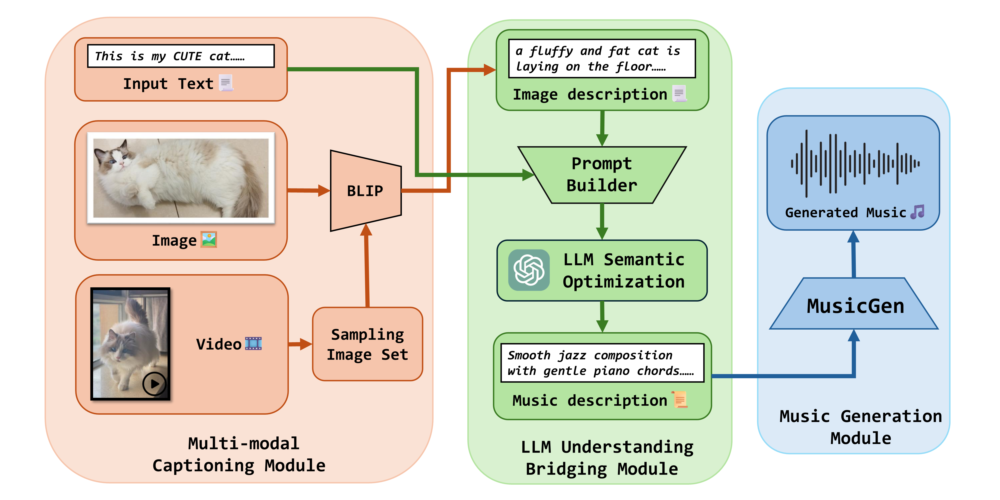

# Mozart's Touch
This is the official implementation of Mozart's Touch: A Lightweight Multi-modal Music Generation Framework Based on Pre-Trained Large Models




## Package Description
This repository is structured as follows:
```
Diancai-Backend
├─MozartsTouch/: source code for the implementation of Mozart's Touch
│  ├─model/: pre-trained MusicGen model
│  ├─static/: static source for test purpose
│  ├─utils/: source code for the modules
│  ├─download_model.py: download pre-trained MusicGen model to model/
│  ├─api_key.ini: OpenAI API key
│  └─main.py: Main program of Mozart's Touch
│ outputs/: directory to store generation result music
│ backend_app.py: program for backend web application of Mozart's Touch
└─start_server.py: start the backend server of Mozart's Touch
```
## Setup
1. Before running, please configure `api_key.ini` in the `/MozartsTouch/`  in the following manners:
   > [OpenAI]
   >
   > API_KEY=sk-xxxxxxx
2. Install dependencies using `pip install -r requirements.txt`.
3. Run [download_model.py](MozartsTouch/download_model.py) to download MusicGen model parameters.
4. Use [MozartsTouch.img_to_music_generate()](MozartsTouch/main.py) to generate music.

To test codes without importing large models, set `test_mode` to `True` in [main.py](MozartsTouch/main.py).

 Switch between "musicgen_medium" or "musicgen_small" by modifying `music_gen_model_name` in [main.py](MozartsTouch/main.py).

## Running as a Web Backend Server

1. Install dependencies using `pip install -r requirements_for_server.txt`.
2. Configure port number and other parameters in[start_server.py](/app/start_server.py).
3. Run `python start_server.py`.
4. Access http://localhost:3000/docs#/ to view the backend documentation and test the APIs.


## TO-DO List
- 增加用户输入提示词功能
- ~~删除API中的mode~~
- 优化音乐生成部分MusicGen模型的代码（主要需求：优化生成效率）
- 部署视频配乐的功能，尝试将 `Video-Llama` 或者 `Video-BLIP2` 整合到我们的项目中。
- Use `argparse` to call model
- Add support for other models as an alternative e.g. LLaMa.


